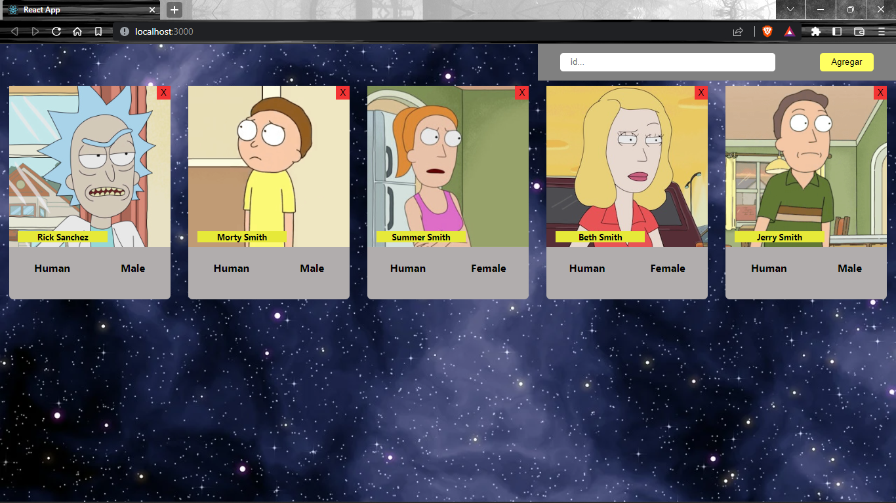

# **💪 HW7 | React Estilos - Integration**

## **🕒 DURACIÓN ESTIMADA**

Dependerá de todo el amor que le quieras colocar a tu app 💛

<br />

---

<div align="center">

## **💻 RICK AND MORTY APP 💻**

</div>

## **📝 INTRODUCCIÓN**

A partir de ahora todas las homeworks integradoras se trabajarán directamente en la aplicación que creaste en la homework anterior.

En esta homework podrás escoger entre cualquiera de los tipos de estilos que hemos aprendido en la lecture para aplicarlos en tu aplicación:

-  **Legacy**
-  **Inline Styling**
-  **CSS Module**
-  **Styled Components**

> [**NOTA**]: en caso de utilizar **`Styled Components`** deberás instalar dicha dependencia desde la carpeta raíz de tu proyecto de **_Rick & Morty:_**

```bash
    npm install styled-components
```

<br />

---

## **📋 INSTRUCCIONES**

### **👩‍💻 EJERCICIO 1**

¡Tu tarea consiste en agregar estilos CSS para que los componentes **Card**, **Cards** y **SearchBar** se vean increibles!

No hay consignas que debas seguir, puedes darle tu toque personal. **Sé creativ@!** 🧑‍🎨

Puedes guiarte con esta imagen:


